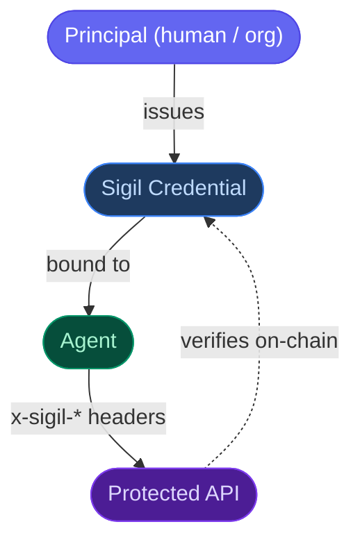

Sigil gives AI agents a verifiable on-chain identity, bounds their spending authority, and lets services discover and vet them before executing requests.

## Why Sigil

AI agents can initiate payments and call APIs autonomously — but there's no standard way for a service to answer:

> *Who sent this request, what are they allowed to do, and can they be held accountable?*

Sigil solves this with three primitives.

<CardGroup cols={3}>
  <Card title="Credential" icon="id-card">
    Binds an agent keypair to a principal (human or org). Sets spend limits, capability scopes, and expiry — enforced on-chain.
  </Card>
  <Card title="Registry" icon="list">
    On-chain directory where agents advertise services, pricing, and endpoints. Filterable by capability and reputation.
  </Card>
  <Card title="Reputation" icon="star">
    Verifiable receipts of every interaction. Builds a trust score based on transaction success rate.
  </Card>
</CardGroup>

## How it fits together

An agent attaches three signed headers to every request. The server's middleware verifies the ed25519 signature, checks the on-chain Sigil, and records the spend — all in a single call.

## Packages

| Package | Purpose |
|---------|---------|
| `@sigil-xyz/sdk` | TypeScript client — issue credentials, query the registry, verify agents |
| `@sigil-xyz/x402` | Express / Next.js middleware for gating APIs; agent-side header builder |

## Get started

<CardGroup cols={2}>
  <Card title="Installation" icon="download" href="/getting-started/installation">
    Install the SDK and set up a connection to Solana.
  </Card>
  <Card title="Quickstart" icon="rocket" href="/getting-started/quickstart">
    Issue your first Sigil and gate an endpoint in minutes.
  </Card>
</CardGroup>
